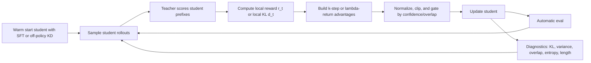

# K-Step Reward-to-Go OPD for Language Models

## Executive Summary

K-step reward-to-go OPD is worth pursuing, but only as a **carefully controlled bias–variance interpolation**, not as a default replacement for ordinary token-level OPD. The central reason is that the direct evidence is mixed. On the positive side, neighboring work on RL-based sequential distillation shows that multi-step return estimators can reduce variance and improve downstream performance, and the broader OPD literature is converging on the view that current one-token supervision is often too brittle. On the negative side, the closest OPD-specific evidence points the other way: MiniLLM explicitly found that collapsing reverse-KL reward-to-go into a single-step decomposition improves stability, a recent OPD analysis proves that stronger future coupling increases variance, and a practical implementation report from entity["organization","Thinking Machines Lab","ai research lab"] says discount factors above zero did not help in their setup. citeturn5view0turn30view0turn7view0turn28view0

My bottom-line assessment is therefore:

| Question | Assessment |
|---|---|
| Is **plain fixed-k sampled-token OPD** a publishable idea by itself? | **Maybe, but not the strongest version.** The literature now already understands that future reward coupling is the relevant theoretical knob; a naïve fixed-k sweep is interesting, but probably not enough unless the empirical gains are unusually clear. citeturn7view0turn29search0 |
| What is the **best high-upside variant**? | **Adaptive or gated k-step OPD**, ideally combined with **top-K local support matching** or **truncated reverse-KL**, because recent OPD work suggests the bigger practical problem is not only myopic credit, but also one-token signal imbalance and unreliable teacher guidance on off-support prefixes. citeturn7view0turn25view1 |
| What is the **strongest positive signal**? | **KETCHUP**: k-step returns improved RL-based knowledge distillation on XSum, Europarl EN–NL, and GSM8K, with lower variance and better convergence than a one-step reward baseline. citeturn5view0 |
| What is the **strongest negative signal**? | **MiniLLM** found its single-step decomposition reduced variance and reward hacking relative to full reward-to-go optimization, and **Revisiting OPD** shows future coupling increases variance in theory and in toy experiments. citeturn30view0turn7view0 |
| Should you spend serious time on it? | **Yes, if you frame the project as “when and how should future teacher signal be propagated backward?” rather than “does bigger k help?”** That framing creates room for adaptive horizons, confidence gating, trust-region constraints, and top-K local teacher support. citeturn7view0turn20search1turn19search14 |

The most actionable research hypothesis is:

> **Moderate lookahead helps only once the student is already visiting prefixes where teacher guidance is reliable.**  
> In other words, **k-step OPD should likely be conditional on support overlap, teacher confidence, or rollout correctness**, not applied uniformly from the first training step. This is an inference from the combined evidence in recent OPD, reward-induction, and process-reward literatures. citeturn25view1turn7view0turn20search1turn13view0

A sensible go/no-go rule is also clear. If, at matched compute, **k ∈ {2, 4, 8}** cannot beat **k = 1** by at least **1–2 absolute points** on a long-horizon reasoning benchmark while keeping variance, response length, and repetition under control, I would pivot away from fixed-k OPD and toward **local-support OPD**, **adaptive reformulations like Veto**, or **length-stabilized OPD**. citeturn7view0turn16search3turn19search14

## Definitions and Mathematical Framing

### What OPD is

On-policy distillation trains a student on **its own rollouts** and evaluates those rollouts with a teacher. In the modern LLM formulation, the standard objective is the **sequence-level reverse KL** from the student policy to the teacher policy on student-generated trajectories. Recent OPD papers make this the canonical starting point. citeturn25view1turn7view0

Let the prompt be \(x\), the student policy be \(\pi_\theta\), the teacher be \(\pi_T\), and a sampled student continuation be \(y_{1:T} \sim \pi_\theta(\cdot \mid x)\). Let the prefix state at time \(t\) be \(s_t = (x, y_{<t})\). Define the sampled-token reverse-KL reward

\[
r_t \;=\; \log \pi_\theta(y_t \mid s_t) \;-\; \log \pi_T(y_t \mid s_t).
\]

Then the sequence-level reverse KL can be written as

\[
J_{\text{seq}}(\theta)
\;=\;
\mathbb{E}_{y \sim \pi_\theta(\cdot \mid x)}
\Bigg[
\sum_{t=1}^T r_t
\Bigg]
\;=\;
D_{\mathrm{KL}}(\pi_\theta(\cdot \mid x)\,\|\,\pi_T(\cdot \mid x)).
\]

This is the formulation used in recent OPD analyses. citeturn25view1turn7view0

### Two meanings of token-level OPD that matter here

The recent literature uses **two nearby but not identical views** of “token-level OPD,” and it is important not to conflate them.

Under the **objective decomposition view**, the same sequence-level reverse KL admits an **exact per-prefix decomposition** into local reverse-KL terms. Recent work distinguishes three practical variants built from that decomposition: **sampled-token OPD**, which Monte-Carlo samples one token from the student at each prefix; **full-vocabulary OPD**, which computes the full local KL over the vocabulary; and **top-K OPD**, which restricts the local KL to a subset of tokens. citeturn25view1

Under the **policy-gradient view**, the exact gradient of sequence-level reverse KL can be written in **causal reward-to-go form**, where each token’s update depends on the current token’s log-ratio **plus future log-ratios**. Recent work then calls the common immediate-reward approximation “token-level OPD,” because it keeps only the current reward term and drops future coupling. That approximation has lower variance but is biased relative to the full causal estimator. citeturn7view0

This distinction is exactly where your idea lives.

### Token-level OPD in the reward-to-go sense

Using the score-function identity, the exact causal estimator for the gradient of sequence-level reverse KL has the form

\[
\nabla J_{\text{seq}}(\theta)
=
\mathbb{E}
\Bigg[
\sum_{t=1}^T
G_t
\nabla \log \pi_\theta(y_t \mid s_t)
\Bigg],
\quad
G_t = \sum_{u=t}^T r_u,
\]

up to an ignorable constant baseline term of the kind that appears explicitly in MiniLLM. citeturn7view0turn30view0

The **token-level / immediate-reward approximation** replaces the full return-to-go \(G_t\) with just the one-step reward

\[
G_t^{(1)} = r_t.
\]

This is the practical “sampled-token OPD” style update that dominates many current implementations because it is local, cheap, and much lower variance. Recent OPD work argues that this variance advantage is the main reason it is so widely used in long-horizon post-training. citeturn7view0turn25view1

### K-step reward-to-go OPD

A natural interpolation is

\[
G_t^{(k,\gamma)}
=
\sum_{j=0}^{k-1}
\gamma^j \, r_{t+j},
\]

with truncation at the end of the sequence. Here \(k\) is the lookahead horizon and \(\gamma \in [0,1]\) is a discount factor.

This gives a continuum:

- \(k=1\) or \(\gamma=0\): ordinary token-level OPD  
- \(k=T\) and \(\gamma=1\): full causal sequence-level reward-to-go estimator  
- intermediate \(k,\gamma\): partial future coupling

This exact interpolation is analyzed theoretically in recent OPD work, though only the endpoints are common in current practice. citeturn7view0turn29search0

A practical training loss is then a PPO/REINFORCE-style surrogate with detached advantages, for example

\[
\mathcal{L}_{k\text{-OPD}}
=
-
\mathbb{E}
\Bigg[
\sum_{t=1}^T
\operatorname{stopgrad}(A_t^{(k,\gamma)})
\log \pi_\theta(y_t \mid s_t)
\Bigg],
\]

where \(A_t^{(k,\gamma)}\) is a centered, normalized, and optionally clipped form of \(G_t^{(k,\gamma)}\). This is the simplest way to add lookahead without changing the rollout or teacher-scoring pipeline. It is also why **k-step OPD is almost free computationally** relative to k=1: the added cost is mostly just a batched reverse scan over token rewards, not extra model forwards. That last point is an implementation inference from the standard OPD loop used in current codebases. citeturn28view0turn25view1turn15search2

### The local-KL alternative

There is also an important alternative design. Instead of building reward-to-go from **sampled-token log-ratios**, one can define a local divergence \(d_t\) at each visited prefix using **full-vocabulary reverse KL** or **top-K truncated reverse KL**, then apply k-step return construction to those denser local terms. This would combine **better per-prefix supervision** with **future credit assignment**. Recent OPD work strongly suggests that this hybrid is a better research direction than raw sampled-token lookahead alone. citeturn25view1turn7view0

## Motivations and Intuition

The cleanest intuition for k-step OPD is the notion of a **forking token**. In long reasoning trajectories, an early token often matters not because it is locally improbable under the teacher, but because it sends the student onto a branch where many later tokens become bad. Token-level OPD can miss that structure, because it only tells the model whether the **current** sampled token looks teacher-like; it does not directly give the current token credit or blame for how the **rest of the trajectory** develops. This is precisely why the theory paper on Revisiting OPD introduces reward-to-go as the natural sequence-level correction to a purely local estimator. citeturn7view0

That intuition is also consistent with broader sequence modeling work. Sequence-level knowledge distillation was motivated by the fact that autoregressive models are trained at the token level but evaluated at the sequence level; minimum risk training similarly optimizes expected sequence-level evaluation metrics rather than next-token likelihood; and multi-token prediction pretraining shows that supervising more than one future token can improve downstream generative performance. None of those are OPD, but all support the idea that **single-step supervision can be too myopic**. citeturn12view2turn12view3turn3search2

There is also a stronger alignment-specific motivation. RLHF and DPO-style methods optimize **sequence-level reward** with some form of sequence-level KL control to a reference policy. OPD sits between SFT and RL in a useful way: it is on-policy like RL, but it provides dense teacher-derived token feedback. K-step OPD is attractive because it pushes OPD slightly toward the RL side of that spectrum without giving up teacher grounding entirely. citeturn28view0turn12view1turn11search7

The problem is that the failure modes point in exactly the opposite direction. MiniLLM derives a reward-to-go form for minimizing reverse KL, but then adds **single-step decomposition** because full reward-to-go has high variance and invites reward hacking; Revisiting OPD formalizes the same point; and recent OPD stabilization papers identify repetition, length inflation, and unreliable guidance on student prefixes as dominant practical problems. So the real intuition is not simply “future reward should help.” It is **“future reward might help when the teacher’s future feedback is still trustworthy.”** citeturn30view0turn7view0turn16search3turn19search14

That is why I would treat k-step OPD as a **conditional credit assignment mechanism**, not a uniform horizon extension. The most promising design knobs are therefore:

- **support overlap** between teacher and student distributions at the prefix,
- **teacher entropy / perplexity** on the visited prefix,
- **rollout correctness** or partial correctness,
- **response position** and truncation depth,
- and whether the local reward is **sampled-token**, **top-K**, or **full-vocabulary**.

Those diagnostics are already being used or proposed in recent OPD papers, which makes them natural conditioning variables for a k-step extension. citeturn25view1turn20search1turn7view0

## Literature Review and Codebases

### Foundational and neighboring papers

| Paper | Why it matters for k-step OPD | Key method | Datasets and metrics | Links |
|---|---|---|---|---|
| **Sequence-Level Knowledge Distillation** | Classic sequence-level teacher–student distillation baseline; establishes that sequence-level objectives can be meaningfully approximated for autoregressive generation. | Train student on teacher beam-search outputs; “hard” sequence-level KD. | WMT’14 and IWSLT-style NMT settings; BLEU is the key metric. citeturn12view2 | Paper citeturn12view2 |
| **Minimum Risk Training for Neural Machine Translation** | Early direct optimization of expected sequence-level task reward; an important precursor to reward-to-go thinking. | Optimize expected task loss under sampled outputs rather than token-level likelihood. | Chinese–English and English–French MT; BLEU and related translation metrics. citeturn12view3 | Paper citeturn12view3 |
| **Teacher Forcing Recovers Reward Functions for Text Generation** | Foundation for inducing dense stepwise rewards from next-token models; central to later reward-induced KD papers. | Derives stepwise reward from teacher-forced model via inverse-RL/Bellman view. | Several text-generation tasks; main claim is better non-parallel/semi-supervised text generation via dense rewards. citeturn10search5turn10search3 | Paper / repo citeturn9search4turn10search0 |
| **f-Divergence Minimization for Sequence-Level KD** | Gives exact or bounded stepwise decompositions for sequence-level KL, reverse KL, JS, and TVD; very relevant to alternative OPD objectives. | Sequence-level \(f\)-divergence framework with teacher- and student-sampled terms; JS and TVD as stronger baselines than plain KL in many settings. | DART, XSum, WMT16 EN–RO, Commonsense Dialogue; BLEU, METEOR, TER, BERTScore, MoverScore, BLEURT, ROUGE, chrF. citeturn25view2 | Paper / repo citeturn12view0turn24search0 |
| **On-Policy Distillation of Language Models** | First major LLM OPD paper; establishes the training-on-student-rollouts paradigm. | Generalized KD on self-generated outputs with flexible loss functions on student trajectories. | Summarization, translation, arithmetic reasoning, and task-agnostic instruction tuning. citeturn26view0 | Paper citeturn7view2 |
| **MiniLLM** | Extremely important because it explicitly derives reverse-KL reward-to-go, then shows why single-step decomposition is practically helpful. | Reverse-KL objective, policy-gradient derivation with \(R_t\), teacher-mixed sampling, length normalization, and single-step decomposition. | Instruction-following and long-text generation; Rouge-L, human evaluation, GPT-4 feedback, ECE, ExAccErr, response-length analysis. citeturn30view0 | Paper / repo citeturn30view0turn15search0 |
| **DistiLLM** | Strong efficiency baseline; useful because any k-step OPD project must beat or justify its cost against streamlined off-policy KD. | Skew-KL objective plus adaptive off-policy use of student-generated outputs. | Instruction-following tasks; downstream task performance and training speed, with up to 4.3× speedup in the abstract. citeturn31view0 | Paper / repo citeturn31view0turn15search1 |
| **LLMR** | Reward-induced KD directly from an LLM teacher; closely adjacent to k-step OPD via dense teacher-derived rewards. | Bellman-style reward induction from pretrained LLM logits, then RL-based student training. | Dialogue generation and summarization datasets; task-specific generation metrics. citeturn32view0turn32view1 | Paper citeturn32view0turn32view1 |
| **PLaD** | Sequence-level preference calibration baseline; relevant if k-step OPD is compared against preference-based sequence supervision instead of pure divergence. | Pseudo-preference pairs where teacher output is preferred to student output; ranking loss calibrates sequence likelihood. | TL;DR and Anthropic-HH; win rate plus ROUGE, with reward-model and GPT-3.5-turbo evaluation. citeturn22view1 | Paper citeturn22view1 |
| **Direct Preference Knowledge Distillation** | Bridges reverse-KL distillation and implicit reward/preference ideas; useful conceptual neighbor to OPD. | Two-stage KD combining implicit reward and reverse KL, then preference probability improvement. | Various datasets with 120M–13B students/teachers; response precision and exact-match-oriented evaluation. citeturn23view0 | Paper / code link citeturn23view0 |
| **AlignDistil** | Token-level alignment as adaptive policy distillation; useful if you want to compare k-step OPD against token-level reward shaping from preferences. | DPO-reward-equivalent token distributional objective, contrastive DPO reward, token-adaptive logit extrapolation. | Alignment benchmarks; fast convergence and token-level reward optimization, reported in ACL 2025. citeturn19search0turn19search1 | Paper / repo citeturn19search1turn19search4 |
| **KETCHUP** | The strongest direct positive evidence for k-step returns in sequential KD, although the setting is RL-based KD rather than standard OPD. | k-step Bellman return induction for RL-based KD, with variance analysis and empirical gains over one-step reward induction. | XSum, Europarl EN–NL, GSM8K; ROUGE-1/2/L, BLEU4, chrF, TER, accuracy. citeturn5view0 | Paper / repo citeturn10search8turn27search0 |

Two adjacent literatures matter but should not be confused with OPD. First, RLHF-style sequence optimization for LMs, including the early entity["company","OpenAI","ai company"] paper on fine-tuning from human preferences, shows that sequence-level reward plus KL control can work but also demonstrates reward misspecification and extractive-copying pathologies on summarization tasks. Second, DPO reframes preference optimization as an implicit reward-plus-reference-KL problem; that perspective is conceptually useful because it makes OPD look like another way of turning probabilistic teachers into reward-like signals. Third, multi-token prediction in pretraining shows that supervising more than one future token can improve coding and generative performance, which strengthens the general intuition behind lookahead OPD even though the mechanism is completely different. citeturn12view1turn11search7turn3search2

### Recent OPD-specific papers

| Paper | Main contribution | Why it changes the k-step question | Datasets and metrics | Links |
|---|---|---|---|---|
| **Rethinking On-Policy Distillation of Large Language Models** | Cleanly separates **sampled-token**, **full-vocabulary**, and **top-K** OPD, and introduces dynamic metrics such as overlap ratio and entropy gap. | Makes clear that k-step reward-to-go is only one axis; denser local supervision might be a better fix than longer-horizon coupling. | OPD dynamics study; key diagnostics are overlap ratio, overlap-token advantage, and entropy gap. citeturn25view1 | Paper / repo citeturn25view1turn15search2 |
| **Revisiting On-Policy Distillation** | Formalizes the bias–variance tradeoff: token-level OPD is biased w.r.t. sequence-level reverse KL but has much better variance scaling; identifies failure modes and proposes teacher top-K local support matching. | This is the most direct theoretical prior on your idea, because it explicitly introduces discounted return-to-go as the interpolation between k=1 and full sequence-level reward-to-go. | Math reasoning and multi-task agentic-plus-math training; reports more stable optimization and a +19.8% gain over sampled-token baselines in the abstract. citeturn7view0 | Paper / repo citeturn7view0turn15search3 |
| **Self-Distilled Reasoner** | Uses one model as both teacher and student by giving the teacher privileged information. | Shows OPD can be highly token-efficient for reasoning; useful if you want k-step OPD without a separate large teacher. | Mathematical reasoning benchmarks; 4–8× token efficiency over GRPO-style RL in the abstract. citeturn16search0 | Paper / repo citeturn16search0turn17search2 |
| **Demystifying OPD** | Identifies length inflation and truncation collapse as OPD failure modes; proposes StableOPD with reference divergence and rollout mixture distillation. | This is critical because any future-coupled objective can exacerbate length/repetition pathologies if not stabilized. | Multiple math reasoning benchmarks; abstract reports +7.2% average improvement, and the PDF excerpt shows benchmarks including MATH-500, Minerva, OlympiadBench, AMC, AIME24, and AIME25. citeturn16search3turn16search11 | Paper citeturn16search3turn16search11 |
| **Veto** | Constructs an adaptive intermediate target distribution in logit space with a tunable \(\beta\) controlling stability versus decisiveness. | A very plausible competitor to k-step OPD, because it tries to fix local gradient pathologies without propagating noisy future credit. | Reasoning and generation tasks; abstract reports consistent gains over SFT and on-policy baselines. citeturn19search14turn20search3 | Paper citeturn19search14turn20search3 |
| **SCOPE** | Routes on-policy trajectories by correctness into different supervision paths with teacher-perplexity weighting and student-perplexity weighting. | Strong evidence that **signal quality should be gated**, which directly suggests adaptive k-step horizons rather than fixed horizons. | Six reasoning benchmarks; Avg@32 and Pass@32 are the headline metrics. citeturn20search1turn20search7 | Paper citeturn20search1turn20search7 |

### Recommended repositories to adapt

| Repository | What to borrow | Why it is the best starting point |
|---|---|---|
| **THUNLP OPD** | Full-vocab, sampled-token, and top-K OPD infrastructure; overlap and entropy diagnostics. | Best scaffold if you want a modern OPD codebase where k-step can be inserted cleanly and compared against current supervision granularities. citeturn15search2 |
| **revisiting_opd** | Teacher top-K local support matching, top-p rollout sampling, special-token masking. | Best scaffold if your project emphasizes robust signal quality rather than only future coupling. citeturn15search3turn7view0 |
| **MiniLLM in LMOps** | Reverse-KL policy-gradient view, teacher-mixed sampling, single-step decomposition. | Best scaffold for implementing k-step advantages on top of an already reward-to-go-aware codebase. citeturn15search0turn30view0 |
| **jongwooko/distillm** | Efficient off-policy KD infrastructure and skew-KL baseline. | Best efficiency baseline to beat, and a good place to prototype hybrid off-/on-policy schedules. citeturn15search1turn31view0 |
| **LMReward** | Teacher-forcing-based reward induction. | Useful if you want to compare direct OPD against a Bellman/reward-induced alternative. citeturn10search0turn10search5 |
| **KETCHUP** | k-step return code for RL-based sequential KD. | Best direct implementation reference for return construction, variance analysis ideas, and k-step ablations. citeturn27search0turn5view0 |
| **AlignDistil** | Token-level reward-to-distillation bridge and adaptive token weighting. | Useful for combining preference-style token importance with OPD. citeturn19search4turn19search0 |
| **OPSD** | On-policy self-distillation setup. | Useful if you want to explore k-step OPD without a separate large teacher. citeturn17search2turn16search0 |
| **PURE** | Min-form credit assignment on top of OpenRLHF/verl-style tooling. | Best reference if you want to explore alternatives to summation-form reward-to-go, such as clipped or min-form lookahead. citeturn9search15turn13view0 |

## Research Gaps and Opportunity Assessment

The most important gap is that **the literature still does not answer the exact question you care about**: when, on real LLM OPD workloads, does partial future credit \(1 < k < T\) beat the immediate-reward estimator? The theory is already there, and the neighboring RL-KD evidence is encouraging, but the OPD-specific empirical case is still largely indirect. The closest evidence is MiniLLM’s reward-to-go ablation, Revisiting OPD’s toy bias–variance analysis, and practical reports that \(\gamma>0\) did not help in at least one mid-2025 implementation stack. citeturn30view0turn7view0turn28view0

A second gap is that the field has recently discovered that **local signal quality is itself a first-order problem**. Sampled-token OPD wastes most of the teacher’s information on each visited prefix, and recent papers argue that many failures come from one-token imbalance, poor support overlap, or later-token instability rather than from purely myopic credit assignment. This means a successful k-step paper probably has to answer a stronger question: **when does future coupling help after local teacher signal has already been repaired?** citeturn7view0turn25view1turn16search3

A third gap is **teacher trustworthiness on off-support prefixes**. If a student generates a dubious prefix, teacher scores on later tokens may still look superficially good even though the whole trajectory has semantically drifted. Push that backwards through reward-to-go, and the learner may reinforce exactly the wrong early choices. Recent papers address this with teacher-perplexity weighting, support masking, special-token masking, or adaptive target reformulation. A k-step OPD paper that ignores these mechanisms will look under-specified relative to the current frontier. citeturn7view0turn20search1turn19search14

A fourth gap is the **choice of aggregator**. Most formulations assume a sum or discounted sum of future token rewards. But the process-reward literature now argues that sum-form credit assignment can cause reward hacking and that alternatives like min-form aggregation can be much more stable. For k-step OPD, that opens a novel and underexplored design axis:

- sum-form lookahead,
- clipped-sum lookahead,
- min-form lookahead,
- and \(\lambda\)-return mixtures across horizons.

That comparison would be much more novel than a simple \(k\)-sweep. citeturn13view0

### My prioritized assessment

| Variant | Priority | Why |
|---|---|---|
| **Fixed-k sampled-token OPD** | Medium | Cleanest baseline research question, but recent evidence suggests it may lose to stability fixes or denser local supervision. citeturn7view0turn25view1 |
| **Top-K local support OPD + small k** | Very high | Best combination of stronger local signal and modest lookahead; most likely to produce a real accuracy–stability gain. citeturn7view0turn25view1 |
| **Adaptive k based on overlap ratio / teacher perplexity** | Very high | Directly matches the field’s recent move toward signal-quality calibration. citeturn25view1turn20search1 |
| **Min-form or clipped lookahead** | High | Novel and well-motivated by the process-reward literature on reward hacking. citeturn13view0 |
| **Full-vocab k-step OPD** | Medium | Statistically attractive, but memory-heavy and likely hard to scale beyond moderate models or short rollouts. citeturn25view1 |
| **Cross-tokenizer k-step OPD** | Low for first paper | Recent OPD work explicitly flags tokenizer mismatch as a major implementation-level distortion; defer until after same-tokenizer success. citeturn7view0 |

My strongest recommendation is therefore:

> **Do not position the project as “plain k-step OPD.”**  
> Position it as **“adaptive lookahead OPD under calibrated teacher trust”** or **“local-support OPD with gated return-to-go.”**

That framing is both more original and more robust to the strongest existing objections in the literature. citeturn7view0turn20search1turn19search14

## Experimental Program

### Recommended experimental workflow



This workflow matches current OPD systems that sample student trajectories, query the teacher on those trajectories, and optimize using per-token reverse-KL-like signals; the main novelty in your project is how the local token signal is transformed into a lookahead advantage. citeturn28view0turn25view1turn7view0

### Core experimental matrix

| Experiment family | Training setup | Baselines | Main sweeps | Primary metrics | Diagnostics | Success criterion |
|---|---|---|---|---|---|---|
| **Reasoning pilot** | Same-tokenizer open-weight family, e.g. 1.5B–3B student and 7B–32B teacher; start from SFT/off-policy KD warm start | token-level OPD, top-K OPD, full-vocab OPD where feasible, MiniLLM-style single-step, GRPO/PPO or PURE-style RL baseline | \(k \in \{1,2,4,8,16\}\), \(\gamma \in \{0,0.5,0.8,0.95,1\}\), top-K \(\in \{8,32,128\}\) | exact-match accuracy, pass@k / Avg@k, calibration on final answers | overlap ratio, entropy gap, teacher perplexity, variance of \(A_t\), response length, repetition, truncation rate | \(>1\)–\(2\) absolute improvement over k=1 at matched compute on at least one long-horizon benchmark |
| **Long-form generation pilot** | Summarization or translation with moderate rollouts | SeqKD, KL, f-DISTILL, DistiLLM, token-level OPD | same \(k,\gamma\) sweep; compare sampled-token vs top-K local reward | perplexity, ROUGE, BLEU/chrF/TER, human or LLM-judge preference, pairwise win rate | reward autocorrelation over position, KL-to-teacher, length distribution | improvement without length inflation or clear human-quality regression |
| **Signal-quality ablation** | Same reasoning setup as pilot | k=1 OPD, fixed-k OPD | teacher-perplexity gating, overlap-based gating, correctness gating, special-token masking on/off | exact-match / pass@k | percent negative rewards, support overlap, late-token instability | adaptive gates outperform fixed-k |
| **Aggregation ablation** | Same as signal-quality ablation | sum-form k-step | clipped sum, min-form, \(\lambda\)-return, local-KL reward versus sampled-token reward | exact-match / pass@k and stability | reward hacking rate, response length, variance | one non-sum aggregator yields a better accuracy–stability frontier |

These choices are not arbitrary. The current OPD literature shows that reasoning tasks are where OPD is especially attractive, but also where length instability and support mismatch show up most clearly; summarization and translation serve as much cleaner tests of whether lookahead helps beyond reasoning-specific artifacts. citeturn7view0turn16search3turn5view0turn25view2

### Dataset recommendations

If you want one clean paper, I would use **two domains** rather than one:

**Reasoning domain.**  
Use a medium-scale open reasoning corpus for training and a clean suite of exact-match benchmarks for evaluation. Publicly reported OPD-style and neighboring studies use GSM8K, MATH-500/AIME-style benchmarks, and related math suites; KETCHUP explicitly includes GSM8K, while recent OPD stabilization papers focus on math reasoning. If you need a prompt-rich training set, recent practical reports use public reasoning prompt corpora such as OpenThoughts-3 at large scale. citeturn5view0turn16search3turn28view0

**Generation domain.**  
Use one long-form generation task such as XSum or TL;DR and one structured generation task such as translation. XSum is present in both f-DISTILL and KETCHUP; TL;DR appears in PLaD and RLHF-style summarization work; Europarl and WMT-style machine translation show up repeatedly in the sequence-distillation literature. citeturn25view2turn5view0turn22view1turn12view1

A practical split:

- **Training**: 20k–100k prompts for pilot runs, then 100k–400k if the signal is promising
- **Evaluation**: fixed held-out exact-match benchmarks for reasoning; standard test splits for summarization/translation
- **Human eval**: only on the final 2–3 candidates

Those exact training set sizes are recommendations rather than literature facts; the actual budget should depend on your teacher size, rollout length, and whether you use full finetuning or LoRA/QLoRA.

### Model-family recommendations

Because tokenizer mismatch is now a documented OPD failure mode, the first paper should use **same-family teacher–student pairs** with shared tokenization and special tokens. For example, use one family for all main experiments and defer cross-family distillation to a follow-up. This is especially important if you want the results to be interpretable as a statement about reward-to-go rather than about tokenization artifacts. citeturn7view0

I would stage model choices this way:

- **Pilot**: 1.5B–3B student, 7B–14B teacher, same family, LoRA or QLoRA
- **Main**: 3B–7B student, 14B–32B teacher, same family
- **Stretch**: equal-size self-distillation or privileged-context OPSD variant

That progression aligns well with the recent OPD and self-distillation literature. citeturn16search0turn25view1

### Hyperparameters and ablations

A concrete starting grid:

- **k**: \(1, 2, 4, 8, 16\), plus full-horizon where feasible  
- **\(\gamma\)**: \(0, 0.5, 0.8, 0.95, 1.0\)  
- **rollout sampling**: temperature \(0.7\) or \(1.0\), top-p \(0.95\)  
- **rollouts per prompt**: \(2\) to \(8\)  
- **max generation length**: 128–256 for generation pilot, 512–2048 for reasoning pilot depending task  
- **optimizer**: AdamW; LoRA learning rates in the \(10^{-5}\)–\(10^{-4}\) regime, full-fineturning an order of magnitude lower  
- **stability controls**: gradient clipping, advantage normalization, EOS masking, length normalization, optional reference-KL anchor

These are recommendations rather than paper-quoted defaults, but they are directly motivated by what the literature already says matters: length normalization and teacher-mixed sampling in MiniLLM, top-p and special-token handling in Revisiting OPD, reference-based stabilization in Demystifying OPD, and adaptive weighting/gating in SCOPE and Veto. citeturn30view0turn7view0turn16search3turn20search1turn19search14

The ablations I would consider mandatory are:

1. **k and \(\gamma\) independently**  
2. **sampled-token reward versus top-K local reward**  
3. **fixed horizon versus adaptive horizon**  
4. **sum-form versus min-form / clipped lookahead**  
5. **same rollout budget but different rollout temperature**  
6. **with and without a reference-KL anchor**  
7. **with and without overlap/perplexity gating**  
8. **greedy decoding versus pass@k evaluation**

Without these, it will be too easy for a reviewer to say that the gains came from a hidden stability trick rather than from lookahead itself.

### Evaluation metrics

Your evaluation should explicitly separate **task quality**, **distribution matching**, and **credit-assignment diagnostics**.

For **task quality**:

- reasoning: exact-match accuracy, pass@k, Avg@k  
- summarization: ROUGE and pairwise human/LLM-judge preference  
- translation: BLEU, chrF, TER  
- general generation: pairwise win rate and sample-quality judgments

These metrics are standard in the papers above. citeturn5view0turn25view2turn22view1turn12view1

For **distribution matching**:

- rollout reverse KL to teacher  
- approximate full-vocab or top-K KL at visited prefixes  
- support overlap ratio  
- overlap-token advantage  
- student–teacher entropy gap

Those OPD-specific diagnostics already exist in recent OPD work and should be reused. citeturn25view1

For **credit-assignment diagnostics**:

- variance of \(A_t^{(k,\gamma)}\) by position  
- covariance of \(r_t\) with future \(r_{t+h}\)  
- correlation of early-token advantages with final correctness  
- teacher perplexity along the trajectory  
- length-inflation, repetition, and truncation-collapse rates

These last diagnostics are where your paper will become convincing. If the future-coupled estimator helps, it should show up there first.

### Statistical testing

Use **paired tests at the prompt level**, not only seed-level averages.

- For exact-match reasoning benchmarks: **McNemar’s test** or paired bootstrap over prompts  
- For ROUGE/BLEU/chrF: **paired bootstrap resampling**  
- For pairwise human or LLM-judge preferences: **exact binomial tests** and confidence intervals on win rate  
- For all automatic metrics: **3–5 random seeds** and report mean, standard deviation, and prompt-level confidence intervals

If budget is tight, prioritize prompt-level paired testing over adding many more seeds.

## Implementation Guidance

### Minimal pseudocode

```python
# prompts: batch of input prompts
# student.sample returns sampled tokens, masks, and student logprobs on sampled tokens
rollouts = student.sample(
    prompts,
    n_samples=n_samples,
    temperature=temp,
    top_p=top_p,
    max_new_tokens=max_new_tokens,
    return_logprobs=True,
)

# Teacher scores the same sampled continuations with teacher forcing.
teacher_logprobs = teacher.score_sampled_tokens(
    prompts,
    rollouts.tokens,
)

# Immediate sampled-token reverse-KL reward
# positive => student more likely than teacher, so minimizing reverse KL uses negative advantage
r = rollouts.logprobs - teacher_logprobs

# Optional local-support reward instead of one-token reward:
# r = truncated_reverse_kl(student_logits, teacher_logits, topk=K)

# Build k-step discounted return-to-go
A = discounted_truncated_cumsum(r, gamma=gamma, horizon=k, mask=rollouts.mask)

# Optional stabilizers
A = mask_special_tokens(A, rollouts.mask, eos_id=eos_id)
A = length_normalize(A, rollouts.lengths)
A = confidence_gate(A, teacher_perplexity, overlap_ratio)
A = normalize_and_clip(A, clip_value=clip_value)

# PPO/REINFORCE-style local update
loss = -((A.detach()) * rollouts.logprobs * rollouts.mask).sum() / rollouts.mask.sum()

# Optional reference anchor or local-KL auxiliary term
loss = loss + beta_ref * ref_kl_term(student, ref_model, prompts, rollouts.tokens)

loss.backward()
optimizer.step()
optimizer.zero_grad()
```

This pseudocode is the direct extension of current OPD pipelines that compute per-token reverse-KL-like rewards from teacher logprobs. The only truly new part is the return construction and gating layer. citeturn28view0turn25view1turn7view0

### Computational cost

The striking thing about k-step OPD is that **its systems cost is almost the same as k=1 OPD**. With sampled-token rewards, you already pay for:

1. student rollout generation,
2. student logprobs on sampled tokens,
3. teacher scoring on the same sampled trajectory.

Moving from \(k=1\) to \(k>1\) typically adds only an \(O(BT)\) reverse scan per batch, where \(B\) is the flattened number of sampled trajectories and \(T\) is sequence length. That is negligible compared with teacher scoring. In other words, **k-step OPD is cheap computationally but expensive statistically**. citeturn28view0turn25view1

The real cost driver is **what local reward you use**:

| Variant | Extra model cost relative to sampled-token k=1 | Memory profile | Expected tradeoff |
|---|---|---|---|
| **Sampled-token k-step** | Almost none | store sampled token logprobs and rewards only | cheapest; highest signal brittleness |
| **Top-K local-support k-step** | modest extra teacher/student logit gather | \(O(BTK)\) if you materialize only top-K values | best likely research sweet spot |
| **Full-vocab local-KL k-step** | large | \(O(BTV)\) if naïvely materialized | strongest local signal, often impractical at scale |

This is why I would not begin with full-vocab k-step OPD unless you are working with small enough models or very short responses. Recent OPD papers explicitly present top-K OPD as the practical middle ground. citeturn25view1turn7view0

### Efficient computation tricks

A few engineering choices matter disproportionately.

**Teacher forcing over the whole sampled rollout.**  
Do not query the teacher token by token unless you have to. Current OPD implementations score completed sampled rollouts with teacher forcing in one pass, which is vastly more efficient and easy to batch. citeturn28view0

**Vectorized reverse scan for k-step returns.**  
Use a reverse cumulative scan or a fused kernel. For truncated windows, subtract the discounted tail once it exits the horizon. The operation is lightweight enough that it should never be the bottleneck.

**Packed batching by length.**  
Length dispersion will dominate memory waste in reasoning tasks. Bucket rollouts by generated length and pack aggressively before teacher scoring.

**Cache only what you need.**  
For sampled-token rewards, cache sampled token ids, masks, student logprobs, teacher logprobs, and a few diagnostics. Do not retain full logits unless you are explicitly testing top-K or full-vocab variants.

**Separate training-time rollout and scoring stacks.**  
The teacher is an evaluator, not a trainable network. Treat it as an inference service if your framework supports that pattern.

**Prefer same-tokenizer teacher–student pairs.**  
This is not just conceptual hygiene; recent OPD work finds tokenizer and special-token mismatch can directly distort the supervision signal. citeturn7view0

### Practical implementation variants I would test first

The most promising implementation variants are:

| Variant | Formula sketch | Why it is promising |
|---|---|---|
| **Fixed-k sampled-token** | \(A_t=\sum_{j=0}^{k-1}\gamma^j r_{t+j}\) | cleanest baseline |
| **Top-K local-support + fixed-k** | \(r_t \leftarrow \mathrm{KL}_{S_t}(\pi_\theta||\pi_T)\), then k-step return | fixes one-token brittleness first |
| **Adaptive-k by overlap/confidence** | \(k_t=f(\text{overlap}_t,\text{teacher perplexity}_t)\) | only uses future coupling when teacher signal is reliable |
| **\(\lambda\)-return OPD** | geometric mixture over n-step returns | smoother bias–variance tradeoff than one fixed \(k\) |
| **Min-form lookahead** | \(A_t=\min_{u \in [t,t+k)} r_u\) or clipped variant | directly targets spike-driven reward hacking concerns |

The adaptive and min-form variants are the ones I would personally bet on.

## Risks, Resources, and Milestones

### Main risks and likely mitigations

| Risk | Why it is likely | Mitigation |
|---|---|---|
| **Variance explosion as k or \(\gamma\) grows** | This is the main theoretical result in recent OPD analysis and the practical reason single-step decompositions keep reappearing. citeturn7view0turn30view0 | keep \(k\) small at first; use adaptive horizons; normalize and clip advantages |
| **Unreliable teacher guidance on off-support prefixes** | Now a documented OPD failure mode. citeturn7view0 | perplexity gating, top-K support matching, mixed off-/on-policy warm start |
| **Length inflation and repetition collapse** | Recent OPD stabilization work makes this failure mode explicit. citeturn16search3 | response-length monitors, reference-KL anchor, rollout-mixture training, EOS-aware masking |
| **Reward hacking under summed future rewards** | MiniLLM and PURE both warn about reward hacking under poorly controlled summation-style credit assignment. citeturn30view0turn13view0 | try min-form/clipped aggregation; length normalization; correctness gating |
| **No measurable gain over strong local OPD baselines** | Recent evidence suggests better local support matching may dominate raw lookahead. citeturn25view1turn7view0 | compare against top-K and Veto-like baselines, not only against k=1 sampled-token |
| **Tokenizer mismatch artifacts** | Explicitly observed in recent OPD work. citeturn7view0 | same-family same-tokenizer first paper only |

### Resource estimates

Because you did not specify model family, infrastructure, rollout length, or finetuning method, the estimates below are necessarily approximate.

| Stage | Suggested setup | Approximate budget | Output |
|---|---|---|---|
| **Pilot reproduction** | 1.5B–3B student, 7B–14B teacher, LoRA/QLoRA, 20k–50k prompts, 128–256 new tokens | **hundreds** of A100-80GB GPU-hours total across baselines and a small k/\(\gamma\) sweep | working OPD baseline, diagnostics, one clean reasoning result |
| **Main study** | same student range or 3B–7B student, 50k–150k prompts, 256–512 new tokens, 3–5 seeds on finalists | **low thousands** of A100-80GB GPU-hours | paper-quality comparison across fixed-k, adaptive-k, and local-support variants |
| **Scale-up / camera-ready** | 7B student, 14B–32B teacher, 100k+ prompts, longer rollouts, human eval | **several thousand** A100-80GB GPU-hours | stronger headline result and robustness section |

The key scaling fact is that **teacher scoring dominates cost**; the move from k=1 to k>1 barely changes compute, so you should budget as if you were running ordinary OPD plus extra ablations. That is why the most expensive part of the project is not lookahead itself, but the number of candidate variants you decide to test. citeturn28view0turn25view1

### Prioritized timeline

| Phase | Goal | Deliverable | Go / no-go criterion |
|---|---|---|---|
| **Initial reproduction** | Reproduce token-level OPD and one stronger local baseline | stable k=1 baseline, overlap/entropy diagnostics, one reasoning benchmark | stop if baseline itself is unstable |
| **Core k-step sweep** | Fixed-k and \(\gamma\) sweep on one reasoning setup | variance curves, accuracy curves, length/repetition diagnostics | continue only if some \(k>1\) beats k=1 or clearly improves diagnostics |
| **Adaptive/gated variants** | Add overlap/perplexity/correctness gating and top-K local reward | best-performing adaptive variant | continue only if adaptive version dominates fixed-k |
| **Cross-domain validation** | Summarization/translation or another non-reasoning domain | evidence the effect is not math-specific | optional if reasoning results are already strong |
| **Final polish** | Human eval, robustness, failure analysis, ablations | paper-ready result | if gains are narrow, position as negative result on bias–variance tradeoff |

The single most important milestone is the second one. If a disciplined fixed-k study shows nothing beyond noise, that is already a useful result, but it should redirect the project toward **adaptive trust-weighted lookahead** rather than further sweeping larger horizons.

### Final recommendation

If I were allocating research time today, I would **absolutely spend a short, focused cycle on this idea**, but with a narrow scope and a sharp falsification plan:

1. **Start from a strong same-tokenizer OPD codebase.**
2. **Implement fixed-k sampled-token OPD in one week.**
3. **Immediately compare it against top-K local-support OPD and a reference-stabilized baseline.**
4. **If fixed-k alone is weak, pivot to adaptive-k or min-form lookahead rather than continuing a larger fixed sweep.**

That is the version of the project most likely to produce either a publishable positive result or a clean, valuable negative result. The raw idea is promising; the literature now strongly suggests the **publishable version is not “more future reward,” but “future reward only when the teacher can still be trusted.”** citeturn7view0turn20search1turn19search14turn16search3